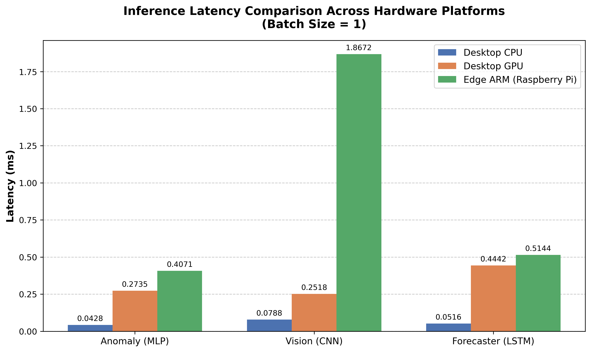

# ML_Benchmark
This project is an Edge AI Systems Lab that explores how machine learning models behave across different hardware environments and optimization levels. It consists of three models built in PyTorch: a sensor-based anomaly detection model that identifies abnormal patterns in time-series data (simulating edge sensor monitoring), a lightweight vision classifier that detects image categories using a small CNN (representing perception tasks like those in robotics or autonomous systems), and a regression forecasting model that predicts future values from sequential data (capturing real-world prediction tasks like energy or system load forecasting). All models are exported and deployed through ONNX Runtime, then evaluated across three environments: CPU (baseline general-purpose computing), GPU (accelerated high-performance inference), and an edge device such as a Raspberry Pi (resource-constrained real-world deployment). The goal of the project is to analyze the tradeoffs between accuracy, latency, memory usage, and computational efficiency across hardware platforms, demonstrating how modern AI systems must be optimized not just for intelligence, but for practical deployment under real-world hardware constraints.

### Baseline Performance Metrics (CPU)
| Model | Architecture | Target Application | Primary Metric | CPU Latency |
| :--- | :--- | :--- | :--- | :--- |
| **Model 1** | MLP Autoencoder | Sensor Anomaly Detection | Threshold: 0.5228 MSE | ~0.05 ms (Batch 1) |
| **Model 2** | 2D CNN | Vision Classification | 71.07% Accuracy | ~0.08 ms (Batch 1) |
| **Model 3** | LSTM | Energy Load Forecasting | 0.0072 MSE | ~0.86 ms (Batch 32)* |

*\*Note: Model 3 latency recorded at Batch Size 32. Models 1 & 2 recorded at Batch Size 1.*

### Hardware Inference Benchmarks

**Test Parameters:**
* **Batch Size:** 1
* **Format:** Unquantized `.onnx` (Float32)
* **Measurement:** Average latency over 50 inference cycles

| Model Architecture | Desktop CPU (ms) | Desktop GPU (ms) | Edge ARM (ms) |
| :--- | :--- | :--- | :--- |
| **Model 1: Anomaly Detector (MLP)** | 0.0428 | 0.2735 | 0.4071 |
| **Model 2: Vision Classifier (CNN)** | 0.0788 | 0.2518 | 1.8672 |
| **Model 3: Forecaster (LSTM)** | 0.0516 | 0.4442 | 0.5144 |

*Note: Desktop GPU latency is higher than Desktop CPU latency due to the PCIe bus transfer overhead dominating the math execution time for a batch size of 1.*



---

### Installation & Setup
```bash
# Install required dependencies
pip install -r requirements.txt

### Executing the Benchmarks
To replicate the hardware evaluation matrix, run the following commands from the root directory:

# 1. Run the desktop CPU/GPU evaluation
python -m benchmarks.desktop_benchmark

# 2. Run the massive batch-size GPU stress test
python -m benchmarks.gpu_stress_test

# 3. (On Edge Device) Run the ARM hardware evaluation
python -m benchmarks.edge_benchmark